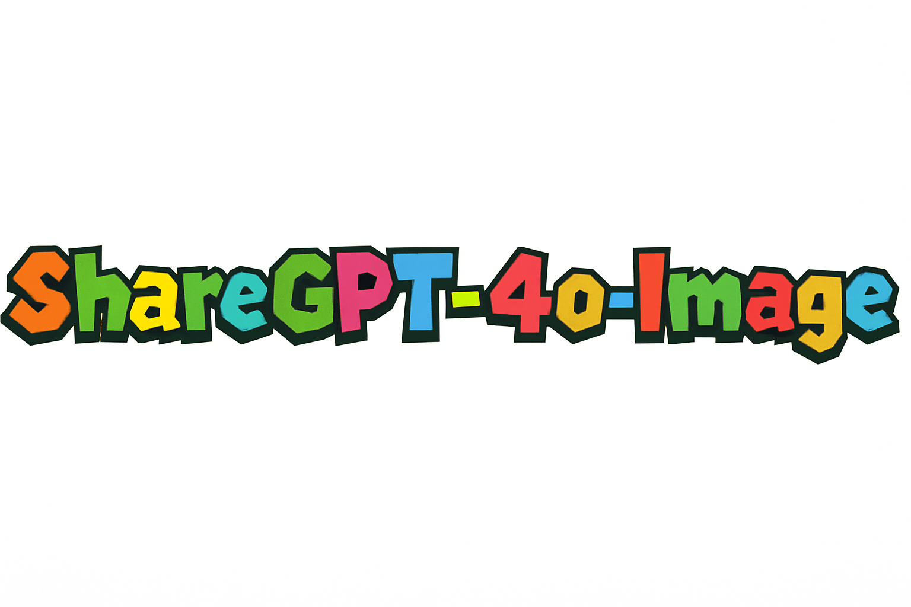
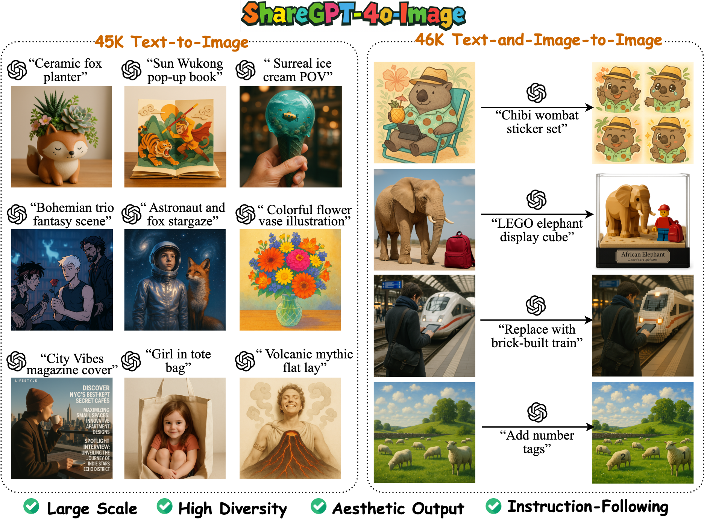

# ShareGPT-4o-Image: Aligning Multimodal Models with GPT-4o-Level Image Generation

<!--
<p align="center">
<br>
</p>
-->

<div align="center">
  <h4>
 📃 <a href="https://arxiv.org/abs/2506.18095" target="_blank">Paper</a>
</h4>
<h4>
  📚 <a href="https://huggingface.co/datasets/FreedomIntelligence/ShareGPT-4o-Image" target="_blank">ShareGPT-4o-Image</a>
</h4>
  <h4>
  🤗 <a href="https://huggingface.co/FreedomIntelligence/Janus-4o-7B" target="_blank">Janus-4o-7B</a>
</h4>
</div>

## ⚡ Introduction
**ShareGPT-4o-Image** is a large-scale, high-quality dataset of 92K samples generated by **GPT-4o’s image generation capabilities**, including **45K text-to-image** and  **46K text-and-image-to-image** examples. It aims to support the development of open multimodal models aligned with GPT-4o’s strengths in image generation. Besides, we introduce **Janus-4o**, a new multimodal large language model (MLLM) capable of both text-to-image and text-and-image-to-image generation. 

> ⚠️ **Statement**: **ShareGPT-4o-Image** is a distilled dataset from GPT-4o-Image, offering 4o-level data quality (_referring to data, not model capability_). **Janus-4o** is a fine-tuned version of Janus-Pro on this dataset, with added image editing support. Fine-tuning brings noticeable gains in image generation, but **Janus-4o still lags behind GPT-4o-Image in overall performance**.

<div align=center>

</div>

## 🖼️ ShareGPT-4o-Image

**ShareGPT-4o-Image** contains a total of **91K image generation samples** from GPT-4o, categorized as follows:

| Data Type               | Number of Samples |
| ----------------------- | ----------------- |
| Text-to-Image           | 45,717            |
| Text-and-Image-to-Image | 46,539            |
| **Total**               | **92,256**        |


> 🔗 Dataset on Hugging Face: [FreedomIntelligence/ShareGPT-4o-Image](https://huggingface.co/datasets/FreedomIntelligence/ShareGPT-4o-Image)

## 🎨 Janus-4o Model
**Janus-4o** is a multimodal LLM capable of both text-to-image and text-and-image-to-image generation. It is fine-tuned from Janus-Pro using the [ShareGPT-4o-Image](https://huggingface.co/datasets/FreedomIntelligence/ShareGPT-4o-Image) dataset. Compared to Janus-Pro, Janus-4o **newly supports text-and-image-to-image generation capabilities**, along with notable improvements in text-to-image generation.


#### Model Access
Janus-4o is available on Huggingface:

|                 | Backbone           | Checkpoint                                                                            |
|----------------------|--------------------|---------------------------------------------------------------------------------------|
| **Janus-4o**  | Janus-Pro-7B         | [FreedomIntelligence/Janus-4o-7B](https://huggingface.co/FreedomIntelligence/Janus-4o-7B)             |

#### Model Inference

**📦 Step 1: Install Janus**

Clone the [Janus](https://github.com/deepseek-ai/Janus) repository and install the package:
```shell
git clone https://github.com/deepseek-ai/Janus.git
cd Janus
pip install -e .
```

**🧠 Step 2: Run Inference**
<details open>
<summary><h4>A. Launch with Gradio Demo</h4></summary>

```shell
pip install -e .[gradio]
python demo/app_janus4o.py
```

</details>

<details>
<summary><h4>B. Text-to-Image Generation</h4></summary>

```Python
import os
import PIL.Image
import torch
import numpy as np
from transformers import AutoModelForCausalLM
from janus.models import MultiModalityCausalLM, VLChatProcessor

# Load model and processor
model_path = "FreedomIntelligence/Janus-4o-7B"
vl_chat_processor: VLChatProcessor = VLChatProcessor.from_pretrained(model_path)
tokenizer = vl_chat_processor.tokenizer
vl_gpt: MultiModalityCausalLM = AutoModelForCausalLM.from_pretrained(
    model_path, trust_remote_code=True,torch_dtype=torch.bfloat16
)
vl_gpt = vl_gpt.cuda().eval()

# Define text-to-image generation function
def text_to_image_generate(input_prompt, output_path, vl_chat_processor, vl_gpt, temperature = 1.0, parallel_size = 2, cfg_weight = 5):

    torch.cuda.empty_cache()

    conversation = [
            {
             "role": "<|User|>",
            "content": input_prompt,
        },
        {"role": "<|Assistant|>", "content": ""},
    ]

    sft_format = vl_chat_processor.apply_sft_template_for_multi_turn_prompts(
        conversations=conversation,
        sft_format=vl_chat_processor.sft_format,
        system_prompt="",
    )

    prompt = sft_format + vl_chat_processor.image_start_tag

    mmgpt = vl_gpt

    image_token_num_per_image = 576
    img_size = 384
    patch_size = 16

    with torch.inference_mode():
        input_ids = vl_chat_processor.tokenizer.encode(prompt)
        input_ids = torch.LongTensor(input_ids)

        tokens = torch.zeros((parallel_size*2, len(input_ids)), dtype=torch.int).cuda()
        for i in range(parallel_size*2):
            tokens[i, :] = input_ids
            if i % 2 != 0:
                tokens[i, 1:-1] = vl_chat_processor.pad_id

        inputs_embeds = mmgpt.language_model.get_input_embeddings()(tokens)

        generated_tokens = torch.zeros((parallel_size, image_token_num_per_image), dtype=torch.int).cuda()

        for i in range(image_token_num_per_image):
            outputs = mmgpt.language_model.model(inputs_embeds=inputs_embeds, use_cache=True, past_key_values=outputs.past_key_values if i != 0 else None)
            hidden_states = outputs.last_hidden_state

            logits = mmgpt.gen_head(hidden_states[:, -1, :])
            logit_cond = logits[0::2, :]
            logit_uncond = logits[1::2, :]
            
            logits = logit_uncond + cfg_weight * (logit_cond-logit_uncond)
            probs = torch.softmax(logits / temperature, dim=-1)

            next_token = torch.multinomial(probs, num_samples=1)
            generated_tokens[:, i] = next_token.squeeze(dim=-1)

            next_token = torch.cat([next_token.unsqueeze(dim=1), next_token.unsqueeze(dim=1)], dim=1).view(-1)
            img_embeds = mmgpt.prepare_gen_img_embeds(next_token)
            inputs_embeds = img_embeds.unsqueeze(dim=1)

        dec = mmgpt.gen_vision_model.decode_code(generated_tokens.to(dtype=torch.int), shape=[parallel_size, 8, img_size//patch_size, img_size//patch_size])
        dec = dec.to(torch.float32).cpu().numpy().transpose(0, 2, 3, 1)

        dec = np.clip((dec + 1) / 2 * 255, 0, 255)

        visual_img = np.zeros((parallel_size, img_size, img_size, 3), dtype=np.uint8)
        visual_img[:, :, :] = dec

        os.makedirs(output_path, exist_ok=True)
        output_images = []
        for i in range(parallel_size):
            save_path = output_path.replace('.png','') + f'_{i}.png'
            PIL.Image.fromarray(visual_img[i]).save(save_path)
            output_images.append(save_path)
        return output_images

# Run
prompt = "A stunning princess from kabul in red, white traditional clothing, blue eyes, brown hair"
image_output_path = "./test.png"
text_to_image_generate(prompt, image_output_path, vl_chat_processor, vl_gpt, parallel_size = 2)
```
</details>

<details>
  
<summary><h4>C. Text-and-Image-to-Image Generation</h4></summary>
  
```Python
import os
import PIL.Image
import torch
import numpy as np
from transformers import AutoModelForCausalLM
from janus.models import MultiModalityCausalLM, VLChatProcessor
from dataclasses import dataclass
@dataclass
class VLChatProcessorOutput():
    sft_format: str
    input_ids: torch.Tensor
    pixel_values: torch.Tensor
    num_image_tokens: torch.IntTensor

    def __len__(self):
        return len(self.input_ids)

def process_image(image_paths,vl_chat_processor):
    images = [PIL.Image.open(image_path).convert("RGB") for image_path in image_paths]
    images_outputs = vl_chat_processor.image_processor(images, return_tensors="pt")
    return images_outputs['pixel_values']

# Load model and processor
model_path = "FreedomIntelligence/Janus-4o-7B"
vl_chat_processor: VLChatProcessor = VLChatProcessor.from_pretrained(model_path)
tokenizer = vl_chat_processor.tokenizer
vl_gpt: MultiModalityCausalLM = AutoModelForCausalLM.from_pretrained(
    model_path, trust_remote_code=True,torch_dtype=torch.bfloat16
)
vl_gpt = vl_gpt.cuda().eval()

# Define text+image-to-image generation function
def text_and_image_to_image_generate(input_prompt, input_image_path, output_path, vl_chat_processor, vl_gpt, temperature = 1.0, parallel_size = 2, cfg_weight = 5, cfg_weight2 = 5):
    torch.cuda.empty_cache()

    input_img_tokens = vl_chat_processor.image_start_tag + vl_chat_processor.image_tag*vl_chat_processor.num_image_tokens +vl_chat_processor.image_end_tag + vl_chat_processor.image_start_tag + vl_chat_processor.pad_tag*vl_chat_processor.num_image_tokens +vl_chat_processor.image_end_tag
    output_img_tokens = vl_chat_processor.image_start_tag 

    pre_data = []
    input_images = [input_image_path]
    img_len = len(input_images)
    prompts = input_img_tokens * img_len + input_prompt
    conversation = [
                    {"role": "<|User|>","content": prompts},
                    {"role": "<|Assistant|>", "content": ""}
                ]
    sft_format = vl_chat_processor.apply_sft_template_for_multi_turn_prompts(
        conversations=conversation,
        sft_format=vl_chat_processor.sft_format,
        system_prompt="",
    )

    sft_format = sft_format + output_img_tokens

    mmgpt = vl_gpt

    image_token_num_per_image = 576
    img_size = 384
    patch_size = 16

    with torch.inference_mode():
        input_image_pixel_values = process_image(input_images,vl_chat_processor).to(torch.bfloat16).cuda()
        quant_input, emb_loss_input, info_input = mmgpt.gen_vision_model.encode(input_image_pixel_values)
        image_tokens_input = info_input[2].detach().reshape(input_image_pixel_values.shape[0], -1)
        image_embeds_input = mmgpt.prepare_gen_img_embeds(image_tokens_input)

        input_ids =  torch.LongTensor(vl_chat_processor.tokenizer.encode(sft_format))
        
        encoder_pixel_values = process_image(input_images,vl_chat_processor).cuda()
        tokens = torch.zeros((parallel_size*3, len(input_ids)), dtype=torch.long)
        for i in range(parallel_size*3):
            tokens[i, :] = input_ids
            if i % 3 == 2:
                tokens[i, 1:-1] = vl_chat_processor.pad_id
                pre_data.append(VLChatProcessorOutput(sft_format=sft_format, pixel_values=encoder_pixel_values, input_ids=tokens[i-2], num_image_tokens=[vl_chat_processor.num_image_tokens] * img_len))
                pre_data.append(VLChatProcessorOutput(sft_format=sft_format, pixel_values=encoder_pixel_values, input_ids=tokens[i-1], num_image_tokens=[vl_chat_processor.num_image_tokens] * img_len))
                pre_data.append(VLChatProcessorOutput(sft_format=sft_format, pixel_values=None, input_ids=tokens[i], num_image_tokens=[]))

        prepare_inputs = vl_chat_processor.batchify(pre_data)

        inputs_embeds = mmgpt.prepare_inputs_embeds(
                    input_ids=tokens.cuda(),
                    pixel_values=prepare_inputs['pixel_values'].to(torch.bfloat16).cuda(),
                    images_emb_mask=prepare_inputs['images_emb_mask'].cuda(),
                    images_seq_mask=prepare_inputs['images_seq_mask'].cuda()
                )

        image_gen_indices = (tokens == vl_chat_processor.image_end_id).nonzero()

        for ii, ind in enumerate(image_gen_indices):
            if ii % 4 == 0:
                offset = ind[1] + 2
                inputs_embeds[ind[0],offset: offset+image_embeds_input.shape[1],:] = image_embeds_input[(ii // 2) % img_len]

        generated_tokens = torch.zeros((parallel_size, image_token_num_per_image), dtype=torch.int).cuda()

        for i in range(image_token_num_per_image):
            outputs = mmgpt.language_model.model(inputs_embeds=inputs_embeds, use_cache=True, past_key_values=outputs.past_key_values if i != 0 else None)
            hidden_states = outputs.last_hidden_state

            logits = mmgpt.gen_head(hidden_states[:, -1, :])
            logit_cond_full = logits[0::3, :]
            logit_cond_part = logits[1::3, :]
            logit_uncond = logits[2::3, :]

            logit_cond = (logit_cond_full + cfg_weight2 * (logit_cond_part)) / (1 + cfg_weight2)
            logits = logit_uncond + cfg_weight * (logit_cond-logit_uncond)
            probs = torch.softmax(logits / temperature, dim=-1)

            next_token = torch.multinomial(probs, num_samples=1)
            generated_tokens[:, i] = next_token.squeeze(dim=-1)

            next_token = torch.cat([next_token.unsqueeze(dim=1), next_token.unsqueeze(dim=1), next_token.unsqueeze(dim=1)], dim=1).view(-1)
            img_embeds = mmgpt.prepare_gen_img_embeds(next_token)
            inputs_embeds = img_embeds.unsqueeze(dim=1)

        dec = mmgpt.gen_vision_model.decode_code(generated_tokens.to(dtype=torch.int), shape=[parallel_size, 8, img_size//patch_size, img_size//patch_size])
        dec = dec.to(torch.float32).cpu().numpy().transpose(0, 2, 3, 1)

        dec = np.clip((dec + 1) / 2 * 255, 0, 255)

        visual_img = np.zeros((parallel_size, img_size, img_size, 3), dtype=np.uint8)
        visual_img[:, :, :] = dec

        output_images = []
        for i in range(parallel_size):
            save_path = output_path.replace('.png','') + f'_{i}.png'
            PIL.Image.fromarray(visual_img[i]).save(save_path)
            output_images.append(save_path)
        return output_images

# Run
prompt = "Turn the image into a nighttime scene."
input_image_path = "./test_input.png"
image_output_path = "./test_output.png"
text_and_image_to_image_generate(prompt, input_image_path, image_output_path, vl_chat_processor, vl_gpt, parallel_size = 2)
```

</details>


### 🏋️‍♂️ Model Training
Coming Soon.

## Citation
```
@misc{chen2025sharegpt4oimg,
      title={ShareGPT-4o-Image: Aligning Multimodal Models with GPT-4o-Level Image Generation}, 
      author={Junying Chen and Zhenyang Cai and Pengcheng Chen and Shunian Chen and Ke Ji and Xidong Wang and Yunjin Yang and Benyou Wang},
      year={2025},
      eprint={2506.18095},
      archivePrefix={arXiv},
      primaryClass={cs.CV},
      url={https://arxiv.org/abs/2506.18095}, 
}
```
